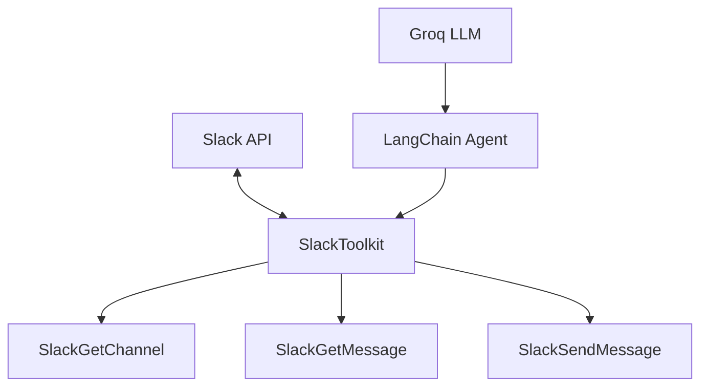

# Arquitectura del Sistema de Agente Slack con LangChain y Groq

## Descripción general

Este documento describe la arquitectura del agente de Slack desarrollado utilizando LangChain y Groq.

## Diagrama de componentes

## Flujo de datos

1. **Inicialización**
   - Carga de variables de entorno
   - Validación de credenciales
   - Configuración de SlackToolkit
   - Inicialización del modelo Groq

2. **Procesamiento de mensajes**
   - Recepción de mensaje desde Slack
   - Análisis por el agente LangChain
   - Generación de respuesta con Groq LLM

3. **Interacción con Slack**
   - Envío de mensajes al canal especificado
   - Lectura de mensajes recientes

## Componentes principales

### Slack Toolkit

- Proporciona una interfaz para interactuar con la API de Slack
- Herramientas incluidas:
  - `SlackGetChannel`: Obtener información de canales
  - `SlackGetMessage`: Recuperar mensajes
  - `SlackSendMessage`: Enviar mensajes

### LangChain Agent

- Implementa el patrón ReAct (Reasoning and Acting)
- Procesa mensajes de entrada
- Decide acciones basadas en el contexto
- Genera respuestas inteligentes

### Groq LLM

- Modelo de lenguaje "llama3-8b-8192"
- Proporciona capacidades de procesamiento de lenguaje natural
- Genera respuestas coherentes y contextuales

## Configuración y dependencias

### Dependencias principales

- LangChain
- LangGraph
- Slack SDK
- Groq API
- python-dotenv

### Configuración

- Variables de entorno para credenciales
- Scopes de Slack necesarios
- Configuración del modelo LLM

## Consideraciones de seguridad

### Gestión de credenciales

- Uso de variables de entorno
- No hardcodear tokens o claves
- Validación de credenciales al inicio

### Control de acceso

- Uso de tokens con scopes mínimos necesarios
- Limitación de acciones del agente

## Extensibilidad

### Puntos de expansión

- Añadir más herramientas de Slack
- Implementar lógica de procesamiento más compleja
- Integrar más modelos LLM

### Mejoras potenciales

- Manejo de errores más robusto
- Logging de actividades
- Autenticación y autorización granular

## Notas finales

La arquitectura está diseñada para ser simple, flexible y fácilmente extensible, permitiendo futuras mejoras y adaptaciones.
